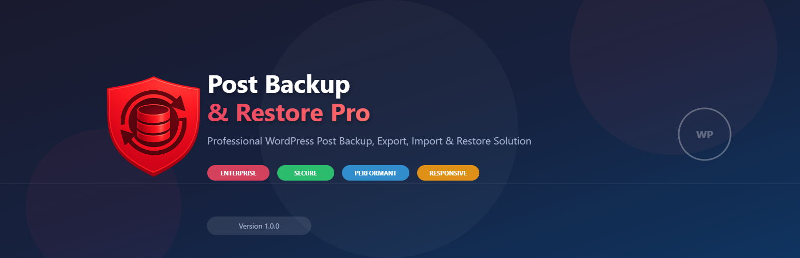

# Post Backup & Restore Pro

<p align="center">
  
</p>

<p align="center">


</p>

---

## 🚀 Professional WordPress Post Backup, Export, Import & Restore Solution

**Post Backup & Restore Pro** is a powerful enterprise-grade WordPress plugin that enables administrators, developers, agencies, hosting providers, and website owners to securely back up, export, migrate, restore, and manage WordPress posts with complete control.

Unlike ordinary export plugins, this plugin provides advanced filtering, backup package generation, media support, taxonomy preservation, metadata migration, ZIP compression, and an intuitive WordPress-native administration interface.

Designed with performance, scalability, and security in mind, Post Backup & Restore Pro makes website migration and content management simple—even for websites containing thousands of posts.

---

## 📑 Table of Contents

- [About](#-about)
- [Features](#-key-features)
- [Why Choose This Plugin](#-why-choose-post-backup--restore-pro)
- [Requirements](#-system-requirements)
- [Installation](#-installation)
- [Quick Start](#-quick-start)
- [Screenshots](#-screenshots)
- [Usage Guide](#-usage-guide)
- [Folder Structure](#-folder-structure)
- [Plugin Architecture](#-plugin-architecture)
- [Security](#-security-architecture)
- [Performance](#-performance-optimization)
- [Frequently Asked Questions](#-frequently-asked-questions-faq)
- [Troubleshooting](#-troubleshooting)
- [Changelog](#-changelog)
- [Roadmap](#-roadmap)
- [Contributing](#-contributing)
- [Support](#-support)
- [License](#-license)
- [Credits](#-credits)
- [Author](#-author)

---

## 📖 About

Managing WordPress content across multiple websites can quickly become challenging. The default WordPress export tool offers only basic functionality and lacks advanced filtering, selective backups, metadata preservation, and professional migration capabilities.

Post Backup & Restore Pro fills this gap by providing a complete backup and migration solution specifically focused on WordPress posts and their associated data.

Whether you are a:

- **Website Owner**
- **WordPress Agency**
- **Freelancer**
- **Developer**
- **Content Publisher**
- **Digital Marketing Company**
- **Hosting Provider**
- **Educational Institution**

this plugin helps you create reliable backup packages that can be restored safely on another WordPress installation.

---

## ⭐ Key Features

### Export Features

- ✅ Export unlimited posts
- ✅ Export selected posts only
- ✅ Export by keyword
- ✅ Export by author
- ✅ Export by category
- ✅ Export by tag
- ✅ Export by post status
- ✅ Export by post type
- ✅ Export by date range
- ✅ Export custom post types
- ✅ Export draft posts
- ✅ Export scheduled posts
- ✅ Export private posts
- ✅ Export featured images
- ✅ Export galleries
- ✅ Export attachments
- ✅ Export post metadata
- ✅ Export taxonomies
- ✅ Export custom fields
- ✅ Export comments (optional)

---

### Import Features

- ✅ Restore exported packages
- ✅ Restore featured images
- ✅ Restore attachments
- ✅ Restore metadata
- ✅ Restore taxonomies
- ✅ Restore categories
- ✅ Restore tags
- ✅ Restore authors
- ✅ Restore post relationships
- ✅ Duplicate detection
- ✅ Safe overwrite options
- ✅ Smart merge support

---

### Backup Features

- ✅ One-click backup
- ✅ ZIP archive generation
- ✅ JSON export support
- ✅ CSV support
- ✅ Backup validation
- ✅ Backup history
- ✅ Backup management
- ✅ Delete backups
- ✅ Download backups
- ✅ Restore backups

---

### Search & Filtering

- ✅ Live keyword search
- ✅ Category filtering
- ✅ Tag filtering
- ✅ Author filtering
- ✅ Status filtering
- ✅ Date filtering
- ✅ Bulk category selection
- ✅ Select All categories
- ✅ Clear All categories
- ✅ Multiple filter combinations

---

### User Interface

- ✅ Native WordPress Admin design
- ✅ Fully responsive layout
- ✅ Mobile friendly
- ✅ Tablet optimized
- ✅ WordPress Core UI
- ✅ Accessible interface
- ✅ Modern dashboard
- ✅ AJAX-powered operations
- ✅ Progress indicators
- ✅ Loading animations

---

### Developer Features

- ✅ WordPress Coding Standards
- ✅ Object-Oriented PHP
- ✅ Modular architecture
- ✅ Extensible codebase
- ✅ Secure AJAX handlers
- ✅ Hooks & Filters
- ✅ Clean code
- ✅ Translation ready
- ✅ Developer friendly
- ✅ Easy customization

---

### Security

- ✅ Nonce verification
- ✅ Capability checks
- ✅ Sanitized inputs
- ✅ Escaped outputs
- ✅ Secure uploads
- ✅ SQL Injection protection
- ✅ XSS prevention
- ✅ CSRF protection
- ✅ Secure file handling
- ✅ WordPress security best practices

---

## 💎 Why Choose Post Backup & Restore Pro?

### 🚀 Enterprise Quality

Built using modern software engineering practices suitable for enterprise WordPress projects.

### 🔒 Security First

Every request is validated using WordPress security APIs, ensuring your data remains protected during export and restore operations.

### ⚡ Optimized Performance

Handles large datasets efficiently through optimized database queries, batch processing, and memory-conscious operations.

### 🎨 WordPress Native Experience

The user interface follows WordPress Core design principles, making it familiar, intuitive, and easy to use.

### 🧩 Modular Architecture

Designed with a modular codebase that simplifies maintenance, future enhancements, and developer customization.

### 🌍 Migration Ready

Move content seamlessly between development, staging, and production environments while preserving metadata, taxonomies, and media.

---

## 📋 System Requirements

| Requirement          | Minimum        | Recommended    |
|----------------------|----------------|----------------|
| WordPress            | 6.2+           | 6.5+           |
| PHP                  | 7.4+           | 8.1+           |
| MySQL                | 5.7+           | 8.0+           |
| MariaDB              | 10.3+          | 10.11+         |
| Memory Limit         | 128 MB         | 256 MB         |
| Upload Limit         | 64 MB+         | 256 MB+        |
| HTTPS                | Not Required   | Recommended    |

---

## 📦 Installation

### Method 1 – Upload Plugin ZIP

1. Download the plugin ZIP package.
2. Log in to your WordPress Admin Dashboard.
3. Navigate to **Plugins → Add New**.
4. Click **Upload Plugin**.
5. Select the downloaded ZIP file.
6. Click **Install Now**.
7. Activate the plugin.
8. Navigate to **Tools → Post Backup & Restore Pro**.

---

### Method 2 – Manual Installation

1. Extract the plugin ZIP archive.
2. Upload the plugin folder to:
   ```
   /wp-content/plugins/
   ```
3. Log in to WordPress.
4. Navigate to **Plugins**.
5. Activate **Post Backup & Restore Pro**.

---

### Method 3 – Git Clone

```bash
git clone https://github.com/iAtifSyed/post-backup-restore-pro.git
```

Move the repository to:
```
/wp-content/plugins/
```
Activate the plugin from the WordPress Plugins page.

---

## ⚙️ Initial Configuration

After activation:

1. Open **Tools → Post Backup & Restore Pro**.
2. Configure your preferred backup settings.
3. Verify upload permissions.
4. Choose your export filters.
5. Generate your first backup package.

No complicated setup is required.

---

## 🚀 Quick Start

Creating your first backup takes only a few steps:

1. Open the plugin dashboard.
2. Navigate to **Export Posts**.
3. Select your desired filters.
4. Click **Apply Filters**.
5. Review the matching posts.
6. Generate the backup package.
7. Download the ZIP archive.

Your backup is now ready for migration or restoration.

---

## 📂 Default Plugin Menu

```
Tools
└── Post Backup & Restore Pro
    ├── Dashboard
    ├── Export Posts
    ├── Import Posts
    ├── Backup History
    ├── Restore
    ├── Settings
    └── Logs
```

---

## 📸 Screenshots

> Screenshots are located inside the **assets/** directory.

| Screenshot                 | Description                  |
| -------------------------- | ---------------------------- |
| `assets/.aistudio/generated_backup.png`  | Dashboard overview           |
| `assets/.aistudio/export_dashboard.png`  | Export Posts page            |
| `assets/.aistudio/selected_posts_export.png`  | Advanced search & filters    |
| `assets/.aistudio/selected_posts_export.png`  | Category selection interface |
| `assets/.aistudio/backup_progress.png`  | Backup generation progress   |
| `assets/.aistudio/generated_backup.png`  | Backup history               |
| `assets/.aistudio/backup-dashboard.png`  | Import backup screen         |
| `assets/.aistudio/screenshot-8.png`  | Restore wizard               |
| `assets/.aistudio/setting_page.png`  | Plugin settings              |
| `assets/.aistudio/log.png` | Activity logs                |

---

## 📖 Usage Guide

Post Backup & Restore Pro has been designed to provide a seamless backup and migration experience while maintaining the familiar look and feel of the WordPress Admin Dashboard.

### 🚀 Getting Started

After activating the plugin:

1. Login to your WordPress Dashboard.
2. Navigate to:
   ```
   Tools → Post Backup & Restore Pro
   ```
3. Open the Dashboard.
4. Verify your system requirements.
5. Configure plugin settings if necessary.
6. Start creating your first backup.

### 🏠 Dashboard

The Dashboard provides an overview of your backup environment.

It displays:
- Plugin Version
- WordPress Version
- PHP Version
- Database Version
- Backup Statistics
- Total Posts
- Available Storage
- Recent Backup Activity
- Latest Restore Logs
- Quick Action Buttons

**Screenshot:** 

*Description:* The Dashboard serves as the central control panel for managing backups, imports, restores, and plugin settings.

### 📤 Export Posts

The Export Posts page allows you to generate highly customized backup packages using advanced filtering options.

Navigate to:
```
Tools → Post Backup & Restore Pro → Export Posts
```

**Screenshot:** 

#### Available Export Filters

**🔎 Keyword Search**
Search posts using title, content, excerpt, or slug. Supports partial keyword matching.

**📂 Categories**
Export one or multiple categories with features including:
- Multi-selection
- Select All
- Clear All
- Responsive category grid
- Scrollable category list

**🏷 Tags**
Filter posts by one or more tags. Supports multiple tag selection, dynamic loading, and taxonomy preservation.

**👤 Author**
Export posts created by a specific author, multiple authors (if enabled), or all authors.

**📄 Post Status**
Filter by: Published, Draft, Pending, Scheduled, Private, or Trash (optional).

**📅 Date Range**
Export posts created today, yesterday, last week, last month, or within a custom date range.

**📌 Post Type**
Supports: Posts, Pages, Custom Post Types, WooCommerce Products (future support), Portfolio Items, Testimonials, and Events.

**Screenshot:** 

*Description:* Advanced filtering allows administrators to export only the content they need, significantly reducing backup size and improving migration efficiency.

### 📁 Category Selection

The Category Selection interface has been redesigned using a responsive grid layout for better usability.

Features include:
- Responsive Grid
- Searchable Categories (future)
- Select All
- Clear All
- Scrollable Container
- Clean WordPress UI

**Screenshot:** 

### ⚡ Applying Filters

Once your filters are selected, click **Apply Filters**.

The plugin will:
- Validate user permissions
- Verify security nonce
- Process selected filters
- Query matching posts
- Display results instantly

### 📋 Export Results

The filtered results display:
- Post Title
- Author
- Category
- Status
- Date
- Featured Image
- Export Status

Bulk selection options allow users to export all displayed posts or selected entries only.

### 📦 Generate Backup

After selecting posts, click **Generate Backup**.

The plugin automatically performs the following operations:
1. Collects post content
2. Exports metadata
3. Exports categories
4. Exports tags
5. Exports featured images
6. Copies attachments
7. Generates JSON package
8. Compresses files
9. Creates ZIP archive

**Screenshot:** 

### 📥 Download Backup

Once backup generation is complete, a secure download link becomes available.

The generated ZIP archive typically contains:
```
backup.zip
├── posts.json
├── metadata.json
├── taxonomy.json
├── attachments/
├── featured-images/
├── manifest.json
└── checksum.txt
```

### 📚 Backup History

Navigate to:
```
Tools → Post Backup & Restore Pro → Backup History
```

The Backup History page lists:
- Backup Name
- Creation Date
- File Size
- Number of Posts
- Backup Type
- Status
- Download
- Restore
- Delete

**Screenshot:** 

### 📥 Import Backup

Navigate to:
```
Tools → Post Backup & Restore Pro → Import Posts
```

Upload a previously exported ZIP package.

Supported formats include:
- ZIP
- JSON (optional)
- Future archive formats

**Screenshot:** 

### 🔄 Import Process

During import the plugin automatically:
✔ Validates ZIP integrity
✔ Reads manifest
✔ Imports posts
✔ Restores metadata
✔ Restores categories
✔ Restores tags
✔ Restores featured images
✔ Restores attachments
✔ Updates relationships
✔ Generates import log

### 🔁 Restore Backup

Navigate to:
```
Tools → Post Backup & Restore Pro → Restore
```

Select an available backup and click **Restore Backup**.

The plugin performs:
- Backup validation
- Compatibility checks
- Duplicate detection
- Safe overwrite
- Media restoration
- Metadata restoration
- Final verification

**Screenshot:** 

### ⚙ Settings

Navigate to:
```
Tools → Post Backup & Restore Pro → Settings
```

Typical configuration options include:

**General:**
- Backup Location
- Temporary Directory
- Cleanup Settings
- Compression Level

**Export:**
- Default Export Format
- Include Media
- Include Metadata
- Include Comments

**Import:**
- Duplicate Handling
- Restore Media
- Restore Authors
- Restore Categories

**Security:**
- Capability Checks
- Nonce Validation
- Upload Restrictions
- File Validation

**Performance:**
- Batch Size
- Memory Limit
- Execution Timeout
- AJAX Processing

**Screenshot:** 

### 📜 Activity Logs

Navigate to:
```
Tools → Post Backup & Restore Pro → Logs
```

Logs include:
- Export Activity
- Import Activity
- Restore Activity
- Errors
- Warnings
- Debug Information
- File Operations
- Security Events

**Screenshot:** 

### 📱 Responsive Design

The plugin interface is fully responsive and optimized for:
- Desktop Computers
- Laptops
- Tablets
- Mobile Devices

Responsive improvements include:
- Flexible Grid Layouts
- Responsive Forms
- Mobile Navigation
- Adaptive Tables
- Touch-Friendly Buttons
- Optimized Scroll Areas

### 💡 Best Practices

To ensure reliable backups and smooth migrations:
- Create backups before major website changes.
- Store backup archives in multiple secure locations.
- Verify backup integrity after creation.
- Test restoration on a staging website before deploying to production.
- Keep WordPress, themes, and plugins updated.
- Regularly review backup history and remove obsolete archives to save storage.

### 🔔 Tips

> **Tip:** Schedule regular backups to minimize the risk of data loss.

> **Tip:** Always test a backup by restoring it on a staging site before using it on a live website.

> **Tip:** Include media files when migrating websites to avoid broken featured images or missing attachments.

> **Tip:** Keep at least three recent backup copies stored in separate locations for disaster recovery.

---

## 📁 Folder Structure

The plugin follows a modular architecture based on WordPress Coding Standards, making it easy to maintain, extend, and customize.

```
post-backup-restore-pro/
│
├── admin/
│   ├── assets/
│   │   ├── css/
│   │   ├── js/
│   │   └── images/
│   │
│   ├── css/
│   ├── js/
│   ├── templates/
│   ├── partials/
│   └── class-admin.php
│
├── assets/
│   ├── css/
│   ├── js/
│   ├── images/
│   └── icons/
│
├── includes/
│   ├── class-loader.php
│   ├── class-export.php
│   ├── class-import.php
│   ├── class-backup.php
│   ├── class-restore.php
│   ├── class-security.php
│   ├── class-logger.php
│   ├── class-installer.php
│   ├── class-helpers.php
│   └── functions.php
│
├── languages/
│
├── templates/
│
├── uploads/
│
├── uninstall.php
├── readme.txt
├── README.md
├── license.txt
└── post-backup-restore-pro.php
```

---

## 🏗 Plugin Architecture

Post Backup & Restore Pro follows a layered architecture to keep business logic separate from presentation and data processing.

```
WordPress
     │
     ▼
Plugin Bootstrap
     │
     ▼
Loader
     │
     ├─────────────┐
     ▼             ▼
 Admin UI      Core Classes
     │             │
     ▼             ▼
 AJAX       Export Engine
     │             │
     ▼             ▼
 Import Engine
     │
     ▼
 Backup Manager
     │
     ▼
 Restore Engine
     │
     ▼
 WordPress Database
```

### 📦 Core Components

**Plugin Bootstrap:** Responsible for plugin initialization, constants, autoloading, hook registration, and dependency loading.

**Loader:** Manages WordPress Hooks, Filters, Admin Pages, AJAX Endpoints, Assets, and Menu Registration.

**Admin Module:** Handles the complete administration interface including Dashboard, Export Screen, Import Screen, Backup History, Restore Wizard, Settings, and Logs.

**Export Engine:** Responsible for generating backup packages. Features include Query Builder, Filter Processing, Metadata Collection, Attachment Collection, Featured Image Export, JSON Generation, ZIP Compression, and Manifest Creation.

**Import Engine:** Restores exported packages safely. Features include ZIP Validation, Manifest Parsing, Duplicate Detection, Metadata Import, Media Restoration, Category Recreation, and Author Mapping.

**Backup Manager:** Responsible for Backup Creation, Backup Storage, Backup Listing, Backup Deletion, Backup Downloads, and Storage Cleanup.

**Restore Engine:** Responsible for Package Validation, File Extraction, Database Restoration, Metadata Restoration, Attachment Restoration, and Final Verification.

### 🗄 Database Usage

The plugin minimizes database usage by leveraging WordPress core tables wherever possible.

It primarily interacts with:

| Table | Purpose |
|--------|----------|
| `wp_posts` | Posts |
| `wp_postmeta` | Metadata |
| `wp_terms` | Categories & Tags |
| `wp_term_taxonomy` | Taxonomies |
| `wp_term_relationships` | Relationships |
| `wp_users` | Authors |
| `wp_options` | Plugin Settings |

No unnecessary custom database tables are created unless future extensions require them.

---

## 🔒 Security Architecture

Security is a core design principle. Every operation undergoes multiple validation layers.

### Authentication
- Logged-in users only
- WordPress authentication
- Capability verification

### Authorization
Role checks include Administrator, Super Admin, and Custom Capabilities. Unauthorized users cannot export, import, restore, or delete backups.

### Nonce Verification
Every form submission includes WordPress Nonce, AJAX Nonce, and CSRF Protection.

### Input Validation
All incoming data is sanitized, validated, and escaped. Examples include Search Keywords, Categories, Tags, IDs, Dates, and File Uploads.

### SQL Security
Database queries use `$wpdb->prepare()`, safe placeholders, and WordPress APIs to prevent SQL Injection attacks.

### Output Escaping
Every output is escaped using WordPress functions such as `esc_html()`, `esc_attr()`, `esc_url()`, and `wp_kses_post()`.

### File Upload Security
Uploaded files are verified for MIME Type, Extension, File Size, ZIP Integrity, and Upload Errors.

### File System Protection
The plugin prevents Directory Traversal, Unauthorized Downloads, Invalid File Access, and Unsafe Extraction.

---

## ⚡ Performance Optimization

Designed for websites with thousands of posts.

### Efficient Database Queries
- Indexed searches
- Limited result sets
- Optimized WHERE clauses
- Lazy loading

### Batch Processing
Large exports are processed in manageable batches to reduce memory usage and execution time.

### AJAX Operations
Long-running tasks use asynchronous processing to avoid browser timeouts and improve user experience.

### Memory Optimization
The plugin minimizes memory usage by streaming data, releasing temporary variables, and processing files incrementally.

### Compression
Generated backups are compressed into ZIP archives to reduce storage requirements and download time.

### Caching
Where appropriate, frequently accessed data is cached to improve performance and reduce redundant database queries.

---

## 🎨 Coding Standards

The project follows:
- WordPress Coding Standards
- PSR Naming Practices (where compatible)
- PHPDoc Documentation
- Semantic Versioning
- Modular File Organization

### 🧩 Hooks & Actions

Developers can extend the plugin using WordPress hooks.

**Example action hooks:**
```php
do_action( 'pbrp_before_export', $posts );
do_action( 'pbrp_after_export', $archive );
do_action( 'pbrp_before_import', $package );
do_action( 'pbrp_after_import', $result );
do_action( 'pbrp_before_restore', $backup );
do_action( 'pbrp_after_restore', $result );
```

### 🔄 Filters

Customize plugin behavior using filters.

**Example filters:**
```php
apply_filters( 'pbrp_export_posts', $posts );
apply_filters( 'pbrp_export_filename', $filename );
apply_filters( 'pbrp_backup_directory', $directory );
apply_filters( 'pbrp_import_options', $options );
apply_filters( 'pbrp_restore_result', $result );
```

### 🌍 Internationalization (i18n)

The plugin is translation-ready with:
- Text Domain Support
- POT File Generation
- Language Files
- RTL Compatibility
- UTF-8 Encoding

### 🔧 Developer Customization

Developers can easily:
- Add custom export filters
- Extend backup formats
- Integrate cloud storage
- Add custom restore handlers
- Register new admin pages
- Extend settings panels
- Add custom logging providers

The modular architecture is designed to support future enhancements without modifying core plugin files.

### 📝 Logging System

The built-in logging system records important operations such as:
- Backup Creation
- Backup Deletion
- Export Events
- Import Events
- Restore Events
- Validation Errors
- File Operations
- Security Checks

Logs assist with troubleshooting and auditing.

### 🧪 Testing Recommendations

Before deploying to production, it is recommended to:
- Test exports with various filters
- Verify backup integrity
- Restore backups on a staging environment
- Validate media and metadata restoration
- Review activity logs for warnings or errors

### 🚀 Future Developer APIs

Planned enhancements include:
- REST API Endpoints
- WP-CLI Commands
- Scheduled Backups
- Cloud Storage Integrations
- Third-Party Plugin Integrations
- Webhook Support
- Advanced Notification System

---

## ❓ Frequently Asked Questions (FAQ)

### 1. What does this plugin do?
Post Backup & Restore Pro allows you to export, backup, import, migrate, and restore WordPress posts along with their associated data such as categories, tags, featured images, attachments, metadata, and custom post types.

### 2. Does this plugin replace the default WordPress Export Tool?
Yes. It provides a far more powerful and flexible alternative with advanced filtering, selective exports, metadata preservation, ZIP packaging, and restore capabilities.

### 3. Can I export only specific posts?
Yes. You can filter posts using keywords, categories, tags, authors, date range, post status, and post type.

### 4. Are featured images included?
Yes. Featured images can be exported and restored automatically.

### 5. Does it export media attachments?
Yes. Media attachments associated with exported posts are included in the backup package (if enabled).

### 6. Can I restore backups on another website?
Absolutely. The generated backup package is designed to be portable between compatible WordPress installations.

### 7. Does the plugin support Custom Post Types?
Yes. Any registered custom post type can be exported and restored.

### 8. Will categories and tags be preserved?
Yes. The plugin restores categories, tags, custom taxonomies, and parent relationships.

### 9. Does it export custom fields?
Yes. Custom fields stored in `wp_postmeta` are preserved.

### 10. Is WooCommerce supported?
Current version supports standard WordPress Posts, Pages, and Registered Custom Post Types. Future versions will include dedicated WooCommerce export and restore support.

### 11. Is multisite supported?
Current release focuses on single-site installations. Multisite support is planned for a future version.

### 12. Can I restore individual posts?
Yes. Depending on your selected restore options, you can restore all posts or only selected content.

### 13. Does it overwrite existing posts?
You control the behavior. Restore options may include Skip Existing, Update Existing, Replace Existing, or Create Duplicate.

### 14. Is there a file size limit?
The practical limit depends on your hosting environment including PHP Memory Limit, Upload Max Filesize, Post Max Size, and Execution Time. Large websites are processed using optimized batch operations where possible.

### 15. Does the plugin work with shared hosting?
Yes. It is designed to work efficiently on most shared hosting providers while also scaling to VPS and dedicated servers.

### 16. Is the plugin secure?
Yes. Security features include Nonce Verification, Capability Checks, Input Sanitization, Output Escaping, Secure File Validation, SQL Injection Protection, CSRF Protection, and XSS Prevention.

### 17. Can I schedule automatic backups?
Not in the initial release. Automatic scheduled backups are planned for a future update.

### 18. Is the plugin translation ready?
Yes. The plugin follows WordPress internationalization standards and supports translation files.

### 19. Does it work with modern WordPress themes?
Yes. The plugin operates entirely within the WordPress Admin Dashboard and is independent of your active theme.

### 20. Where are backup files stored?
Backup archives are stored in a secure plugin-managed directory with restricted direct access, depending on your plugin configuration.

### 21. Can I delete old backups?
Yes. Backup History provides options to download or permanently delete stored backup archives.

### 22. Will my SEO metadata be exported?
If stored as post metadata, SEO-related data can be included in the export package and restored during import.

### 23. Does the plugin support large websites?
Yes. It has been designed with performance optimizations such as batch processing, efficient queries, and ZIP compression to handle large content libraries.

### 24. Is developer customization possible?
Absolutely. Developers can extend functionality using custom hooks, filters, and modular classes without modifying the core plugin.

---

## 🛠 Troubleshooting

### Export Process Stops Unexpectedly

**Possible causes:**
- PHP Memory Limit
- Execution Time Limit
- Hosting Restrictions

**Recommended Solution:**
- Increase PHP Memory Limit
- Increase Max Execution Time
- Export in smaller batches
- Contact your hosting provider if limits cannot be adjusted

### Backup ZIP Cannot Be Downloaded

**Possible reasons:**
- Incorrect file permissions
- Backup generation interrupted
- Server storage full

**Solution:**
- Verify upload directory permissions
- Ensure sufficient disk space
- Regenerate the backup

### Import Fails

Check the following:
- Backup ZIP is not corrupted
- File upload completed successfully
- WordPress version is compatible
- PHP upload limits are sufficient

### Images Are Missing

**Possible causes:**
- Media export disabled
- Attachment files removed
- Upload directory permissions

**Solution:** Re-export the backup with media included and restore again.

### Restore Produces Duplicate Posts

Choose the appropriate duplicate handling option during the restore process, such as updating or skipping existing posts.

### Permission Errors

Ensure your account has administrator privileges and that your server file permissions allow reading and writing in the backup directory.

---

## 📜 Changelog

### Version 1.0.0 - Initial Stable Release

**Added:**
- Plugin Dashboard
- Export Posts
- Import Posts
- Backup History
- Restore System
- Advanced Search Filters
- Category Grid
- Tag Filters
- Author Filters
- Post Status Filters
- Date Filters
- ZIP Backup Generation
- JSON Export
- Metadata Export
- Taxonomy Export
- Featured Image Support
- Attachment Support
- Responsive Admin Interface
- AJAX Operations
- Security Validation
- Logging System
- Translation Support

**Improved:**
- Native WordPress UI
- Responsive Layout
- Performance Optimization
- Code Organization
- Accessibility

**Security:**
- Nonce Verification
- Capability Checks
- File Validation
- Secure Upload Handling
- Sanitization & Escaping

---

## 🗺 Roadmap

The following features are planned for future releases.

### Version 1.1
- Scheduled Backups
- Backup Notifications
- Improved Restore Wizard
- Backup Encryption
- Cloud Storage Preparation

### Version 1.2
- Google Drive Integration
- Dropbox Integration
- Microsoft OneDrive Integration
- Amazon S3 Support

### Version 1.3
- WP-CLI Commands
- REST API
- Backup Automation
- Background Processing
- Queue System

### Version 1.4
- WooCommerce Product Backup
- Orders Export
- Customers Export
- Coupons Export
- Product Images

### Version 1.5
- Multisite Support
- Network Dashboard
- Site Migration
- Cross-Site Restore

### Future Vision

The long-term goal of **Post Backup & Restore Pro** is to become a complete WordPress migration and disaster recovery platform with enterprise-level reliability, automation, and cloud integration.

Future enhancements may include:
- Incremental Backups
- Differential Backups
- Cloud Synchronization
- Remote Backup Storage
- Email Notifications
- Webhook Support
- AI-Assisted Backup Recommendations
- Backup Integrity Monitoring
- Backup Scheduling Calendar
- One-Click Site Migration
- Disaster Recovery Mode
- Enterprise Management Dashboard

---

## 📢 Release Policy

The plugin follows **Semantic Versioning (SemVer)**.

| Version Type | Description |
|--------------|-------------|
| Major | Breaking changes or major new functionality |
| Minor | New features with backward compatibility |
| Patch | Bug fixes, security updates, and performance improvements |

---

## 🐞 Reporting Bugs

If you encounter a bug:

1. Ensure you are using the latest version.
2. Reproduce the issue consistently.
3. Collect relevant error logs or screenshots.
4. Open an issue in the project's GitHub repository with detailed reproduction steps.

---

## 💡 Feature Requests

Feature suggestions are always welcome.

Please include:
- A clear description of the requested feature
- The problem it solves
- Example use cases
- Expected behavior
- Optional mockups or screenshots

This helps prioritize and implement improvements more effectively.

---

## 🤝 Contributing

Contributions are welcome and greatly appreciated. Whether you're fixing bugs, improving documentation, enhancing the user interface, or adding new features, your help makes this project better for everyone.

### Development Workflow

1. Fork the repository
2. Create a feature branch:
   ```bash
   git checkout -b feature/amazing-feature
   ```
3. Make your changes
4. Follow WordPress Coding Standards
5. Test thoroughly
6. Commit your changes:
   ```bash
   git commit -m "Add amazing feature"
   ```
7. Push your branch:
   ```bash
   git push origin feature/amazing-feature
   ```
8. Open a Pull Request

### 📐 Coding Standards

**PHP:**
- WordPress Coding Standards
- PHPDoc comments
- Object-Oriented Programming
- Secure coding practices

**JavaScript:**
- Modern ES6+
- Modular architecture
- Avoid global variables
- Proper event delegation

**CSS:**
- Modular CSS
- Responsive design
- Mobile-first approach
- Avoid inline styles

**HTML:**
- Semantic HTML5
- Accessibility-friendly
- Valid markup
- WordPress admin compatibility

### 🧪 Testing

Before submitting your contribution, verify:
- Plugin activates correctly
- Plugin deactivates correctly
- Export functionality works
- Import functionality works
- Restore functionality works
- Backup history works
- Settings save correctly
- Responsive layout works
- No PHP warnings
- No JavaScript errors
- No console errors
- No accessibility issues

### 📋 Issue Reporting

When reporting bugs, please include:
- WordPress Version
- PHP Version
- Plugin Version
- Browser
- Operating System
- Steps to reproduce
- Expected behavior
- Actual behavior
- Error messages
- Screenshots (if applicable)

---

## 💬 Support

Need help? We're happy to assist.

**Documentation:** Please read the documentation before opening a support request.

**GitHub Issues:** Report bugs and request features at [GitHub Repository](https://github.com/iAtifSyed/post-backup-restore-pro)

**Email Support:** For professional support, licensing, or business inquiries: atifsyedlive@gmail.com

**Feature Requests:** Open a GitHub Issue describing the problem, suggested solution, use case, and expected behavior.

---

## 🔒 Security Policy

If you discover a security vulnerability, please **do not** publish it publicly.

Instead, contact: atifsyedlive@gmail.com

Please include:
- Vulnerability description
- Reproduction steps
- Potential impact
- Suggested mitigation

Responsible disclosure is appreciated.

---

## 🌍 Compatibility

**WordPress:** 6.2+, 6.3+, 6.4+, 6.5+, and future compatible versions.

**PHP:** 7.4, 8.0, 8.1, 8.2, 8.3.

**Browsers:** Google Chrome, Mozilla Firefox, Microsoft Edge, Safari, Opera.

**Operating Systems:** Windows, macOS, Linux.

---

## 🌐 Translation

The plugin is translation-ready using standard WordPress localization.

Example language files:
```
languages/
post-backup-restore-pro.pot
post-backup-restore-pro-en_US.po
post-backup-restore-pro-fr_FR.po
post-backup-restore-pro-es_ES.po
```

---

## 📦 Third-Party Libraries

This plugin primarily relies on WordPress Core APIs. Where applicable, third-party libraries will be documented with their respective licenses.

---

## 📄 License

This project is licensed under the **GNU General Public License v2.0 or later (GPL-2.0+)**.

You are free to use, modify, distribute, and fork under the terms of the GPL license.

For more information, see [LICENSE](LICENSE) or visit https://www.gnu.org/licenses/gpl-2.0.html

---

## 🙏 Credits

Special thanks to:
- WordPress Community
- WordPress Core Contributors
- PHP Community
- Open Source Contributors
- Plugin Testers
- Beta Users
- Designers
- Developers

whose work and dedication continue to improve the WordPress ecosystem.

---

## 👨‍💻 Author

### Atif Syed

**Full Stack WordPress Developer** • Ecommerce Specialist • Plugin Architect • WooCommerce Expert • UI/UX Engineer • Security-First Developer

**Expertise:**
- WordPress Plugin Development
- WooCommerce Development
- Custom PHP Applications
- REST API Development
- JavaScript & jQuery
- HTML5 & CSS3
- MySQL / MariaDB
- Enterprise WordPress Solutions
- Performance Optimization
- Security Hardening

**Portfolio:** https://iatifsyed.github.io/

**GitHub:** https://github.com/iAtifSyed

**Email:** atifsyedlive@gmail.com

---

## ⭐ Support the Project

If this project has helped you:
- ⭐ Star the repository on GitHub
- 🐛 Report bugs
- 💡 Suggest new features
- 🔀 Submit pull requests
- 📢 Share it with the WordPress community

Your support helps improve the project and motivates future development.

---

## 📅 Version Information

| Property | Value |
|----------|--------|
| Plugin Name | Post Backup & Restore Pro |
| Current Version | 1.0.0 |
| Stable Release | Yes |
| License | GPL v2 or later |
| Requires PHP | 7.4+ |
| Requires WordPress | 6.2+ |
| Text Domain | post-backup-restore-pro |
| Translation Ready | Yes |
| Responsive | Yes |
| Accessibility Ready | Yes |

---

## 🚀 Future Vision

Our mission is to make **Post Backup & Restore Pro** the most reliable, secure, and developer-friendly WordPress content migration solution available.

Future releases will focus on:
- Cloud Backup Providers
- Scheduled & Incremental Backups
- One-Click Site Migration
- WP-CLI Integration
- REST API
- WooCommerce Migration
- Enterprise Backup Management
- Remote Backup Monitoring
- Team Collaboration Features
- AI-Assisted Backup Analysis

---

## ❤️ Thank You

Thank you for choosing **Post Backup & Restore Pro**.

Whether you're managing a personal blog, a business website, or hundreds of client installations, we hope this plugin makes your backup and migration workflow faster, safer, and more reliable.

---

<p align="center">

**Made with ❤️ by Atif Syed**

*Full Stack WordPress Developer • Plugin Architect • Ecommerce Specialist*

⭐ If you like this project, don't forget to star the repository!

</p>
